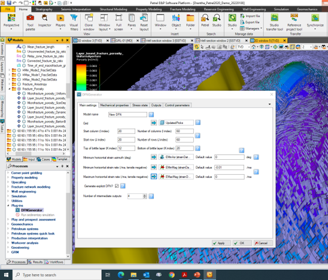

# The challenge of modelling fractures
Natural fracture networks are a major control on fluid flow and geomechanics in the subsurface. They are therefore important for applications including mining and tunnel stability, groundwater flow and pollution monitoring, geothermal energy, CO2 sequestration and hydrocarbon exploration and production.

However they generally cannot be imaged and mapped directly – geophysical methods such as seismic have too low resolution to image fractures, while wellbores give only a 1D viewpoint and very limited coverage.

Currently, if natural fractures are modelled at all, they are modelled stochastically – placed at random locations with arbitrary geometry. The resulting models are typically inaccurate and give poor results when used in geomechanical and fluid flow models
# Introducing connected DFNs (cDFN)
To improve this and generate more accurate fracture models, we have developed a technique for simulating the growth of large fracture networks based on fundamental geomechanical principles. This forward modelling technique, analogous to new sedimentological forward modelling techniques, allows more accurate and realistic fracture models to be generated more quickly, even in cases with limited input data. They can be easily integrated into fluid flow and geomechanical models. This method also allows for more rapid uncertainty modelling.

The DFN Generator software is available to download for free under the Apache 2 open source license. It is available in 2 versions: a stand-alone version with text file input and output, and as a plugin for the Schlumberger Petrel ™ geomodelling package.

# Download the open-source software
| Platform | Version |
| -------- | ------- |
| Petrel (.pip) | Petrel 2020 |
|          | Petrel 2018 |
|          | Petrel 2017 |
|          | Petrel 2016 |
| Standalone | v.1     |
|          | v.1.1     |

Image of the DFN Generator plug-in for Petrel.

# Online documentation and videos
Instructions for installing to Petrel
Documentation for using the Petrel plug-in
Documentation for using the standalone version
# Access our knowledge
- [Online fracture resources](understanding)
- [Technical information & case studies](concept)
- [Contact us for bespoke training & more information](aboutus)

# Cite the literature
Below are a few citations of publications on the code so far, if you use the code, we would greatly appreciate if you could include us in your reference list. :+1:
- Welch, M.J., Lüthje, M., Oldfield, S.J. 2022. DFN Generator v2.0: A new tool to model the growth of large-scale natural fracture networks usi, doi: https://doi.org/10.5194/gmd-2022-22
- Welch, M.J., Lüthje, M., Oldfield, S.J. 2000. Modelling the Evolution of Natural Fracture Networks. Springer Nature Switzerland AG., https://doi.org/10.1007/978-3-030-52414-2. 
- Welch, M.J., Lüthje, M., Glad, A.C. 2019. Influence of fracture nucleation and propagation rates on fracture geometry: Insights from geomechanical modelling. Petroleum Geoscience, 25, 470-489, https://doi.org/10.1144/petgeo2018-161
